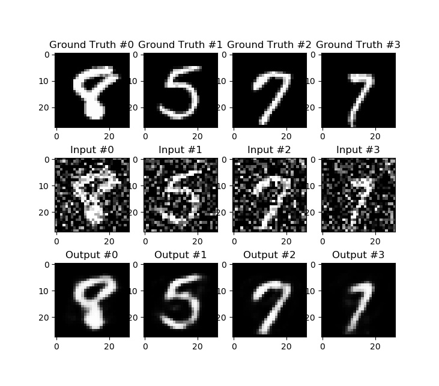
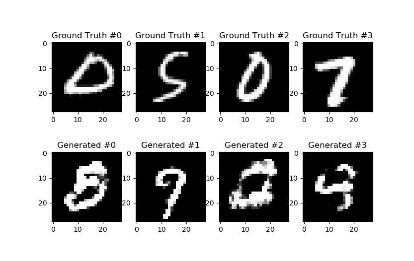
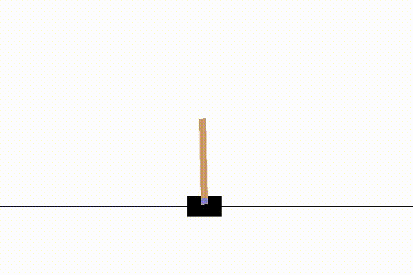
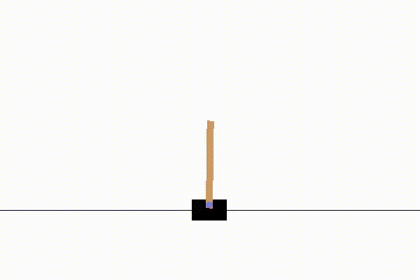

# PyTorch-Collections

A collection of AIs made with PyTorch

## AIs

### Low Level
- [Linear regression](src/lowlevel.py) : Linear regression using only AutoGrad with momentum optimizer, MSE loss

### Image
- [Classification](src/classification.py) : Convolutional neural network which classifies cats / dogs
- [Object Detection](src/obj_detect.py) : Detects where dogs / cats are within an image
- [Auto Encoder](src/autoencoder.py) : An auto encoder with pytorch.nn module for CIFAR10 images
- [Deep Auto Encoder](src/deep_autoencoder.py) : An auto encoder with convolutional layers which generates MNIST digits
- [Denoiser](src/denoiser.py) : Simple denoiser using only fully connected layers for the MNIST dataset
- [GAN](src/gan.py) : Simple Generative Adversarial Network using only fully connected layers, generates MNIST like handwritten digits

### Reinforcement Learning
- [REINFORCE](src/reinforce.py) : REINFORCE algorithm (policy gradient) for gym's CartPole environment
- [A2C](src/a2c.py) : Advantage Actor Critic algorithm (inspired by REINFORCE algorithm) for gym's CartPole environment
- [DQN](src/dqn.py) : Deep Q Leaning implementation (CartPole env again)
- [DDQN](src/ddqn.py) : Double Deep Q Leaning implementation

## Images
### Denoiser

### GAN

### REINFORCE

### A2C

