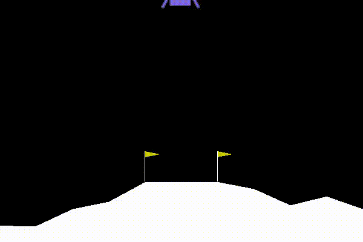

# PyTorch-Collections

A collection of AIs made with PyTorch

## AIs

### Low Level
- [Linear regression](src/lowlevel.py) : Linear regression using only AutoGrad with momentum optimizer, MSE loss

### Image
- [Classification](src/classification.py) : Convolutional neural network which classifies cats / dogs
- [Object Detection](src/obj_detect.py) : Detects where dogs / cats are within an image
- [Auto Encoder](src/autoencoder.py) : An auto encoder with pytorch.nn module for CIFAR10 images
- [Deep Auto Encoder](src/deep_autoencoder.py) : An auto encoder with convolutional layers which generates MNIST digits
- [Denoiser](src/denoiser.py) : Simple denoiser using only fully connected layers for the MNIST dataset
- [GAN](src/gan.py) : Simple Generative Adversarial Network using only fully connected layers, generates MNIST like handwritten digits

### Reinforcement Learning
- [REINFORCE](src/reinforce.py) : REINFORCE algorithm (policy gradient) for gym's CartPole environment
- [A2C](src/a2c.py) : Advantage Actor Critic algorithm (inspired by REINFORCE algorithm) for gym's CartPole environment
- [A2C](src/spinningup_a2c.py) : A2C on LunarLander with Experience Buffer
- [DQN](src/dqn.py) : Deep Q Leaning implementation with basic replay buffer (CartPole env again)
- [DDQN](src/ddqn.py) : Double Deep Q Leaning implementation on LunarLander-v2
- [PER](src/per.py) : Prioritized Experience Replay, this method takes O(n) time to get / O(1) time to add (unlike in the original paper), no IS weights

## Images
### Denoiser

### GAN

### REINFORCE

### A2C

### DDQN

")

## Papers
- [GAN](https://arxiv.org/pdf/1406.2661.pdf)
- [CycleGAN](https://arxiv.org/pdf/1703.10593.pdf)
- [DDQN](https://arxiv.org/pdf/1509.06461.pdf)
- [PER](https://arxiv.org/pdf/1511.05952.pdf)
- [PPO](https://arxiv.org/pdf/1707.06347.pdf)
